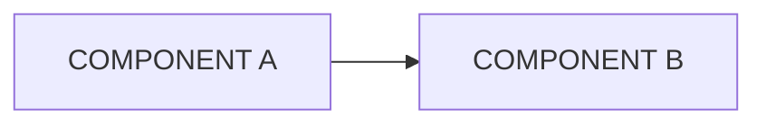

---
tags:
  - data-user
  - node-operator
  - developer
---

# TOOL-NAME: Overview

<!-- What the tool is and who it is for. Copy the introduction from your README.
Keep only the tags above that apply to this page: data-user, node-operator, developer. -->

## Components

<!-- Optional: for tools made of several parts. Delete this section otherwise.
One row per part. Take the descriptions from your README.
"For" uses the tags: data-user, node-operator, developer.
On the other pages, use the component names as headings. -->

| Component | Folder | What it does | For |
|---|---|---|---|
| COMPONENT | `FOLDER/` | DESCRIPTION | node-operator |

<!-- Optional diagram of how the parts connect. -->

## Source

<!-- Link to the repository, e.g. https://github.com/EIDA/TOOL-NAME -->
