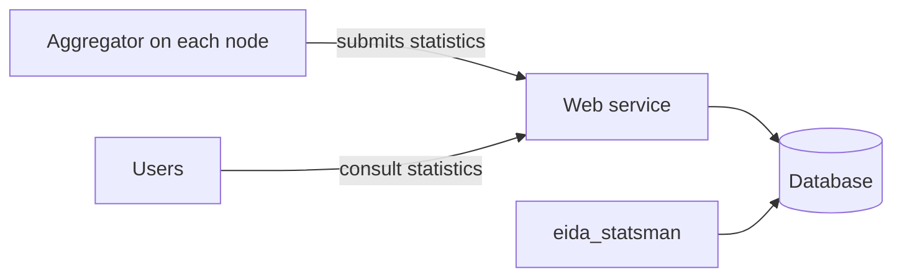

# Example: eida-statistics

[eida-statistics](https://github.com/EIDA/eida-statistics) is made of several
parts, so its overview page would start with a Components section.
Descriptions are quoted from its
[README](https://github.com/EIDA/eida-statistics/blob/main/README.md).

| Component | Folder | What it does | For |
|---|---|---|---|
| Aggregator | [eida-statistics-aggregator](https://github.com/EIDA/eida-statistics-aggregator) | "meant to be deployed on each EIDA node" | node-operator |
| Centralized statistics web service | `webservice/` | "able to receive logging statistics as provided by the aggregator. It stores the logging statistics in a database." | data-user, developer |
| Centralized service management tool | `eida_statsman/` | "A command line interface to manage the central database system" | node-operator |
| Database | `backend_database/` | Containerized PostgreSQL | node-operator |

