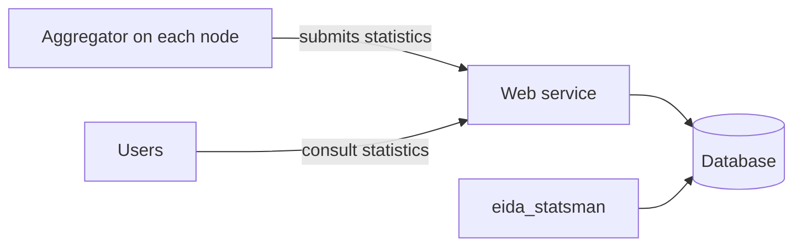

# Example: eida-statistics

[eida-statistics](https://github.com/EIDA/eida-statistics) is made of several
parts, so each part gets its own copy of the template. Descriptions are quoted
from its [README](https://github.com/EIDA/eida-statistics/blob/main/README.md).

## In the repository

```
eida-statistics/
  backend_database/       code, unchanged
  eida_statsman/          code, unchanged
  webservice/             code, unchanged
  docs/
    .nav.yml              title: eida-statistics
    index.md              overview + Components
    webservice/           text from webservice/README.md
      .nav.yml            title: Web service
      index.md
      install.md
      usage.md
      development.md
    eida_statsman/        text from eida_statsman/README.md
      .nav.yml            title: eida_statsman
      index.md
      install.md
      usage.md
    database/             text from backend_database/README.md
      .nav.yml            title: Database
      index.md
      install.md
      development.md
```

`docs/.nav.yml`:

```yaml
title: eida-statistics
nav:
  - Overview: index.md
  - webservice
  - eida_statsman
  - database
```

## On the site

```
Tools
  eida-statistics
    Overview
    Web service
      Overview
      Install
      Usage
      Development
    eida_statsman
      Overview
      Install
      Usage
    Database
      Overview
      Install
      Development
```

## Components section of `docs/index.md`

| Component | Docs | What it does | For |
|---|---|---|---|
| Aggregator | separate repository: [eida-statistics-aggregator](https://github.com/EIDA/eida-statistics-aggregator) | "meant to be deployed on each EIDA node" | node-operator |
| Centralized statistics web service | `webservice/` | "able to receive logging statistics as provided by the aggregator. It stores the logging statistics in a database." | data-user, developer |
| Centralized service management tool | `eida_statsman/` | "A command line interface to manage the central database system" | node-operator |
| Database | `database/` | Containerized PostgreSQL | node-operator |

In the real `docs/index.md`, each folder is a link to that part, for example
`[Web service](webservice/index.md)`.


