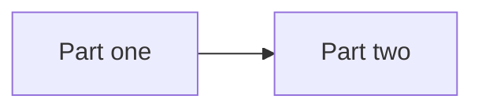

# Tool docs template

Copy [`doc_template`](https://github.com/EIDA/doc/tree/main/doc_template) into
your repository as `docs/`:

```bash
cp -r doc_template my-repo/docs
```

1. Replace `TOOL-NAME` in `.nav.yml` and in every page title.
2. Move your existing text into the pages, replacing the `<!-- ... -->` comments.
3. Delete the pages you have no content for, and their lines in `.nav.yml`.
4. Keep only the tags that apply on each page.

## Rules

- Move existing text into the pages. Do not rewrite it.
- Page titles start with the tool name, for example `# ws-availability: Install`.
- Tags are only `data-user`, `node-operator` and `developer`.
- Links between pages are relative; links to anything else use a full URL.

## Tools with several parts

Give each part its own copy of the template, as a folder inside `docs/`:

```bash
cp -r doc_template my-repo/docs              # overview: keep index.md and .nav.yml only
cp -r doc_template my-repo/docs/part-one
cp -r doc_template my-repo/docs/part-two
```

```
docs/
  .nav.yml          title: <tool>, then Overview and one line per part
  index.md          overview with the Components table
  part-one/         same layout as any tool: .nav.yml, index.md, install.md, ...
  part-two/
```

- In the top `.nav.yml`, list `Overview: index.md` and then each part folder.
- In the top `index.md`, add a Components section after the introduction
  (see below).
- In each part's `.nav.yml`, the title is the part's name.
- Each part's text comes from that part's own README.
- Page titles name the tool and the part, for example
  `# eida-statistics web service: Install`.

Components section for the top `index.md`:

````markdown
## Components

| Component | Docs | What it does | For |
|---|---|---|---|
| Part one | [Part one](part-one/index.md) | Description from its README | node-operator |
| Part two | [Part two](part-two/index.md) | Description from its README | developer |


````

## Examples

- [eida-statistics](examples/eida-statistics.md): a tool made of several parts
- [ws-availability](examples/ws-availability.md): a README split into pages
