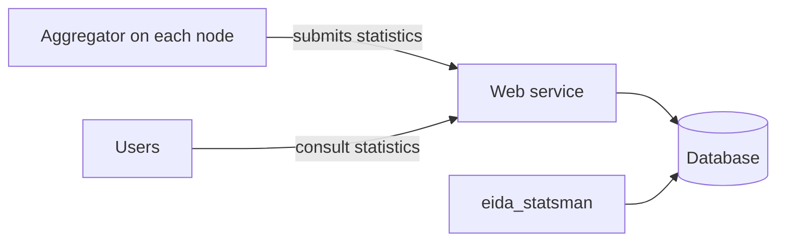

# Tool docs template

Every EIDA tool keeps its documentation in a `docs/` folder in its own
repository. This site copies that folder into `docs/tools/<repo>/`.

## Start from the template

Copy [`doc_template`](https://github.com/EIDA/doc/tree/main/doc_template) from
this repository into your repository as `docs/`:

```bash
cp -r doc_template my-repo/docs
```

Then:

1. Replace `TOOL-NAME` in `.nav.yml` and in every page title.
2. Move your existing text into the pages, replacing the `<!-- ... -->` comments.
3. Delete the pages you have no content for, and their lines in `.nav.yml`.
4. Keep only the tags that apply on each page.

## Layout

```
docs/
  .nav.yml             page order and section title
  index.md             required: what the tool is
  install.md           optional: install, deploy, upgrade
  usage.md             optional: how to run or query it
  configuration.md     optional: settings and options
  troubleshooting.md   optional: known problems and fixes
  development.md       optional: tests, building, contributing
```

## Page titles

Each page title starts with the tool name, for example
`# ws-availability: Install`. Pages are listed by title on the role pages, so
the tool name tells readers which tool a page belongs to. The sidebar uses the
short names from `.nav.yml`.

## Tags

Each page starts with front matter using one or more of these tags, and no
others: `data-user`, `node-operator`, `developer`.

## Rules

- Move existing text into the pages. Do not rewrite it.
- Links between pages in `docs/` are relative, for example `[Usage](usage.md)`.
- Links to anything outside `docs/` use a full URL.
- Keep `README.md` in the repository, and do not add a `README.md` inside `docs/`.
- For tools made of several parts, list them under Components on the overview
  page and use the same names as headings on the other pages.

## Template files

`.nav.yml`:

```yaml
--8<-- "doc_template/.nav.yml"
```

??? note "index.md"

    ````markdown
    --8<-- "doc_template/index.md"
    ````

??? note "install.md"

    ````markdown
    --8<-- "doc_template/install.md"
    ````

??? note "usage.md"

    ````markdown
    --8<-- "doc_template/usage.md"
    ````

??? note "configuration.md"

    ````markdown
    --8<-- "doc_template/configuration.md"
    ````

??? note "troubleshooting.md"

    ````markdown
    --8<-- "doc_template/troubleshooting.md"
    ````

??? note "development.md"

    ````markdown
    --8<-- "doc_template/development.md"
    ````

## Example: components of eida-statistics

[eida-statistics](https://github.com/EIDA/eida-statistics) is made of several
parts, so its overview page would start with a Components section.
Descriptions are quoted from its
[README](https://github.com/EIDA/eida-statistics/blob/main/README.md).

| Component | Folder | What it does | For |
|---|---|---|---|
| Aggregator | [eida-statistics-aggregator](https://github.com/EIDA/eida-statistics-aggregator) | "meant to be deployed on each EIDA node" | node-operator |
| Centralized statistics web service | `webservice/` | "able to receive logging statistics as provided by the aggregator. It stores the logging statistics in a database." | data-user, developer |
| Centralized service management tool | `eida_statsman/` | "A command line interface to manage the central database system" | node-operator |
| Database | `backend_database/` | Containerized PostgreSQL | node-operator |



## Example: ws-availability

[ws-availability](../tools/ws-availability/index.md) follows this template.
Its `README.md` and `BETA.md` were split into pages without rewriting the text.

`docs/.nav.yml`:

```yaml
title: ws-availability
nav:
  - index.md
  - install.md
  - usage.md
  - configuration.md
  - troubleshooting.md
  - development.md
```

Where each README section went:

| README section | Page | Tags |
|---|---|---|
| Intro, References | [index.md](../tools/ws-availability/index.md) | data-user, node-operator |
| Deployment, Upgrading from v1.0.x, First-time database setup, `BETA.md` | [install.md](../tools/ws-availability/install.md) | node-operator |
| Endpoints, What runs daily | [usage.md](../tools/ws-availability/usage.md) | data-user, node-operator |
| Configuration, Tuning | [configuration.md](../tools/ws-availability/configuration.md) | node-operator |
| Troubleshooting | [troubleshooting.md](../tools/ws-availability/troubleshooting.md) | node-operator |
| Development | [development.md](../tools/ws-availability/development.md) | developer |
